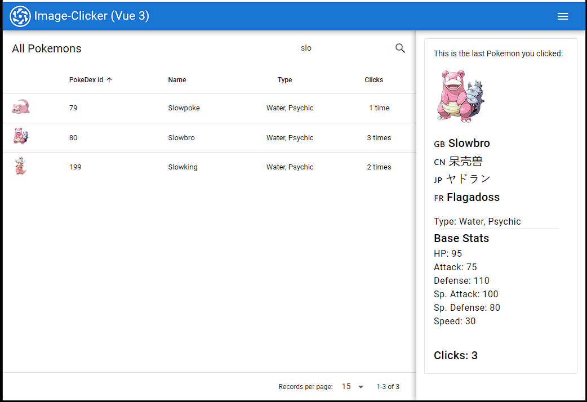

# Image Clicker (image-clicker-ex1)

This is a Single Page Application built using Quasar, the enterprise-ready cross-platform Vue 3 component library.



- It displays all (809) pokemons up to date, on a table. Featuring all the sprites.
- It counts how many times the user clicks on each pokemon.
- On the right side, details of the last pokemon you clicked are shown, such as: base stats, type, and the name in a few languages.
- By default, no details are shown on the right.
- It is responsive, uses a flex layout, and Quasar's CSS Material design classes.
- It ain't much, but it's honest work.

## Dependencies

Assuming you already have the latest LTS version of Node & npm, globally install the [Quasar CLI](https://quasar.dev/start/quasar-cli):

```
npm i -g @quasar/cli
```

Then, you can install the dependencies from the root folder:

```bash
npm install
```

### Start the app in development mode (hot-code reloading, error reporting, etc.)

```bash
quasar dev
```

### Lint the files

```bash
yarn lint
# or
npm run lint
```

### Format the files

```bash
yarn format
# or
npm run format
```

### Build the app for production

```bash
quasar build
```

Tip: Built files are meant to be served over an HTTP server
Opening index.html over file:// won't work

The app will be output to the dist/spa folder, and you can use quasar as a webserver too:

`quasar serve dist/spa`

---

## How is it made?

There are three main Vue components:

- `PokeTable.vue` - will fetch and store pokedex data (only one time: on mount), will listen to child's (QTable) component row-click event, will use the store to save the dictionary associating pokemon:clicks.
- `PokeCard.vue` - will display the last pokemon you clicked by reacting to the lastSelectedPokemon on the store. This card is displayed on the MainLayout.vue.
- `TablePage.vue` - holds the PokeTable inside a QPage, to keep it responsive.

### Layout

You will see the following on MainLayout.vue:

```
  <q-page-container>
    <router-view />
  </q-page-container>
```

The default path (/) routes to TablePage.vue.

Ideally, the PokeTable.vue component could communicate with the PokeCard.vue like so:

- If both were below the same parent component, simply an event from PokeTable could update a property of the MainLayout.vue, which in turn would use a slot to send the updated data to TablePage.vue

Other possible solutions include:

- Using a state management solution like Pinia, as per the official Vue 3 suggestion.
- Use the classic events from the DOM (not reliable in this case)
- By using the Reactivity API, extract the shared state out of the components, and manage it in a global singleton.

I have picked the last out of these solutions, to get familiarized with the Reactivity API.
It has a great advantage: if you wanted to persist the state of the app and synch it between browser tabs, you could store it in the localStorage of the browser.
But also some downsides: global state that can be arbitrarily mutated by any component is not going to be very maintainable in the long run.

In this case, I think it's fine for a SPA, especially when you want to ONLY display global data in components far away from others.

### License
See LICENSE.txt

```
GNU GPLv3

Permissions of this strong copyleft license are conditioned on making available complete source code of licensed works and modifications, which include larger works using a licensed work, under the same license. Copyright and license notices must be preserved. Contributors provide an express grant of patent rights.
```
